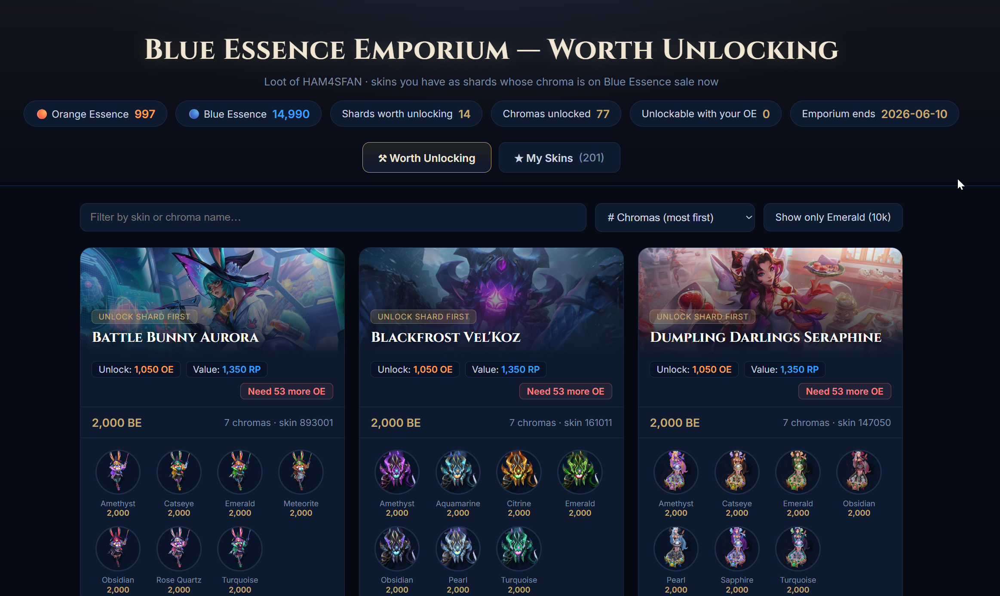

# Blue Essence Emporium — Chroma & Shard Finder

A small Windows tool that reads your **running League of Legends client** and tells you
which of your **skin shards** are worth unlocking right now — because their **chroma is
currently on sale for Blue Essence** in the Blue Essence Emporium.

It then builds a clean visual HTML report (with chroma art), shows your Orange/Blue
Essence balances, and works out how many shards you can actually afford to unlock.

> **No Riot API key required.** Everything is read locally from your own client; image
> art comes from the public Community Dragon CDN. Nothing is uploaded anywhere.



---

<div dir="rtl" align="right">

## 🇪🇬 بالمصري (شرح للمصريين)

البرنامج ده بيقولك أنهي **سكنات عندك في اللوت** (Shards لسه مفتحتهاش) **تستاهل تفتحها دلوقتي**، عشان الكروما بتاعتها متاحة تتشري بالـ **Blue Essence** في الـ **Emporium** حاليًا.

### الفكرة وإيه اللي يخليها مهمة

<ul>
<li>الكروما مينفعش تشتريها غير لو إنت <b>مالِك السكن الأساسي</b>.</li>
<li>طب ولو السكن عندي Shard بس؟ يبقى السؤال: <b>"أفتح أنهي Shard عشان بعد كده أقدر أشتري الكروما بتاعته بالـ BE؟"</b></li>
<li>عروض الـ Emporium بتتغيّر كل باتش ومفيش حد بيعرف هيكون فيه إيه — فالكلاينت بتاعك هو المصدر الوحيد للمعلومة، والبرنامج بيقراها لايف.</li>
</ul>

### بيعمل إيه بالظبط

<ul>
<li>بيقرا الـ Shards اللي عندك + رصيدك من الإسنس (🟠 برتقاني = بيفتح الـ Shards، 🔵 أزرق = بيشتري الكروما).</li>
<li>بيطلعلك الكروما المتاحة بالـ BE دلوقتي وسعرها وآخر ميعاد للعرض.</li>
<li>بيحسبلك تقدر تفتح <b>كام Shard</b> برصيد الإسنس البرتقاني اللي معاك (يبدأ بالأرخص)، وفاضلك كام عشان الباقي.</li>
<li>بيعملك صفحة HTML شيك فيها صور الكروما، وفيها تبويبين: <b>«تستاهل تفتحها»</b> و <b>«سكناتي»</b> (معرض بصور كبيرة لكل السكنات اللي معاك).</li>
</ul>

### إزّاي تشغّله (أسهل طريقة)

<ol>
<li>نزّل ملف <b>EmporiumChromaFinder.bat</b> من صفحة الـ <a href="../../releases">Releases</a>.</li>
<li>افتح اللعبة وسجّل دخول لحد ما توصل للشاشة الرئيسية.</li>
<li>اعمل <b>دبل-كليك</b> على الملف وسيبه يشتغل. هيفتحلك في الآخر صفحة في المتصفح فيها النتيجة.</li>
</ol>

> لو Python مش متظبط على الجهاز، البرنامج هيحاول يظبّطه لوحده. ولو ويندوز طلّعلك تحذير <i>"Windows protected your PC"</i> دوس <b>More info ← Run anyway</b> (الملف نصّي عادي تقدر تفتحه بالـ Notepad وتطمّن).

### مهم تعرفه (الخصوصية والأمان)

<ul>
<li>مفيش أي <b>API key</b> مطلوب خالص.</li>
<li>البرنامج بيشتغل على جهازك بس، وبيقرا من الكلاينت محليًا — <b>مفيش أي حاجة بتترفع أونلاين</b>.</li>
<li>بيقرا بس، عمره ما هيفتح أو يشتري أو يغيّر أي حاجة في حسابك من نفسه.</li>
<li>الصور بس اللي بتتجاب من سيرفر <b>Community Dragon</b> العام (مفتوح للكل).</li>
</ul>

</div>

---

## Why this exists

The Blue Essence Emporium is a limited-time event. Its chroma offers are **randomized per
patch with no public preview**, so the only reliable source of "what's on sale right now"
is your own client.

A chroma can only be bought if you **own its base skin**. If a skin is sitting in your loot
as an *unlocked shard*, the practical question is:

> *"Which of my shards are worth unlocking, because once I own the skin I could immediately
> buy its chroma with Blue Essence?"*

This tool answers exactly that:

```
answer = { skin shards in your loot }  ∩  { skins whose chroma is on BE sale now }
```

---

## What it shows

- **Your skin shards**, with each one's unlock cost (Orange Essence) and skin value (RP).
- **Which shards have a chroma on Blue Essence sale**, how many, and the price.
- **Your essence balances** (Orange = unlocks shards, Blue = buys chromas).
- **How many shards your Orange Essence can unlock right now** (cheapest-first), and how
  much more you'd need for the rest.
- A **visual HTML report** with two tabs:
  - **⚒ Worth Unlocking** — shard cards with their on-sale chroma thumbnails, unlock cost,
    value, an "affordable now" badge, and sorting (by # chromas, value, unlock cost, or
    affordability).
  - **★ My Skins** — a big-splash gallery of every skin you already own.

---

## Quick start (non-technical — just want the answer)

1. Download **`EmporiumChromaFinder.bat`** from the [Releases](../../releases) page.
2. Open the **League of Legends client** and log in (reach the home screen).
3. Double-click **`EmporiumChromaFinder.bat`**.

That's it. If Python isn't installed it will offer to install it for you. When it finishes,
a browser tab opens with your report, and all files are saved next to the `.bat`.

> Windows SmartScreen may show *"Windows protected your PC"* for a `.bat` →
> **More info → Run anyway**. The file is plain text — you can open it in Notepad to inspect it.

---

## Run from source (developers / auditors)

Requirements: **Windows**, **Python 3.8+**, a **running League client**.

```bash
python be_chroma_finder.py
```

`requests` is auto-installed if missing; if that fails it falls back to the standard-library
`urllib`, so there are effectively no hard dependencies.

To (re)build the single distributable `.bat` from the source files:

```bash
python build_bat.py        # -> EmporiumChromaFinder.bat
```

### Files

| File | Role |
|------|------|
| `be_chroma_finder.py` | Main program: connects to the client, reads loot/essence/skins, finds BE chromas, matches, prints tables, writes data. |
| `make_webpage.py` | Builds the standalone HTML report from the saved data. Imported by the finder, or run alone: `python make_webpage.py`. |
| `build_bat.py` | Bundles the two scripts into one self-contained `EmporiumChromaFinder.bat`. |

---

## How it works

### 1. Connecting to the client (LCU API)
The League client exposes a local REST API (the **LCU API**) on `https://127.0.0.1:<port>`
with HTTP Basic auth (`riot` / token) and a self-signed certificate. The tool gets the port
and token from the **lockfile** (searched across every drive and common install paths), and
falls back to reading them from the `LeagueClientUx.exe` process arguments
(`--app-port`, `--remoting-auth-token`).

### 2. Reading your shards
`GET /lol-loot/v1/player-loot` → entries with `type == "SKIN_RENTAL"` are skin **shards**
(not yet unlocked). Each carries the skin id (`storeItemId`), name, the Orange Essence
unlock cost (`upgradeEssenceValue`), and RP value.

### 3. Finding the Blue Essence chromas — the key insight
The Emporium feeds the **regular store catalog**: `GET /lol-store/v1/catalog`. In this
catalog, **`IP` is Blue Essence** (the legacy "Influence Points" name). Chromas are entries
with `inventoryType == "CHAMPION_SKIN"` and `subInventoryType == "RECOLOR"`.

The important subtlety: a chroma's normal `prices` block usually shows only the **RP** price.
The **Blue Essence price lives in the `sale` block** (`sale.prices`) — that's the Emporium
discount. So the tool checks **both** places, and when the BE price comes from a sale it
verifies *today is inside the sale's start/end window*. Each chroma's `itemRequirements`
names the base skin you must own — that's the join key against your shards.

### 4. Essence & affordability
Balances come from the loot `CURRENCY` entries: `CURRENCY_cosmetic` = Orange Essence,
`CURRENCY_champion` = Blue Essence. Unlock counts are computed greedily (cheapest shard first).

### 5. The report art
Image URLs are derived from **Community Dragon** (public, keyless, CORS-friendly):
- Chroma icon: `…/v1/champion-chroma-images/{championId}/{chromaId}.png`
- Skin splash: from `skins.json` paths (`/lol-game-data/assets/...` → CDN base, lowercased)

### 6. The single-file `.bat`
`build_bat.py` embeds both Python files after a marker inside a batch launcher. At runtime
the launcher locates Python (or installs it via `winget`), unpacks the embedded scripts to
`%TEMP%`, and runs them. Output is written next to the `.bat` (or your home folder if that
location is read-only).

---

## Output files

All written to the folder the tool runs from (or `%USERPROFILE%\EmporiumChromaFinder` as a fallback):

| File | Contents |
|------|----------|
| `chroma_report.html` | The visual report (open this). |
| `run_log.txt` | Detailed run log — attach this when reporting a problem. |
| `lcu_dump/ANSWER_matches.json` | The shard→chroma matches (with image ids). |
| `lcu_dump/my_skin_shards.json` | Your shards + unlock costs/values. |
| `lcu_dump/emporium_be_chromas.json` | Every chroma on BE sale this rotation. |
| `lcu_dump/*.json` | Raw dumps (loot, store catalog, owned skins) for verification. |

---

## Privacy & safety

- **Local only.** The tool talks to `127.0.0.1` (your own client) and reads public art from
  Community Dragon. It does **not** send your data anywhere.
- **No credentials stored.** The LCU token is read live and used only for the local session.
- **The output files contain your account data** (summoner name, owned skins, loot). They are
  git-ignored by default — don't commit `lcu_dump/`, `chroma_report.html`, or `run_log.txt`.
- This is a read-only tool: it never disenchants, purchases, or modifies anything in your account.

---

## Troubleshooting

| Symptom | Cause / fix |
|---------|-------------|
| "Could not find the League client" / "Connection refused" | Client is closed or still loading. Open it, reach the home screen, run again. |
| "401 Unauthorized" | The session token changed — restart the client and rerun. |
| "404" on an endpoint | Riot moved it in a patch. Open an issue with your `run_log.txt`. |
| "Could not unpack the embedded finder" (`.bat`) | You ran it from *inside* the zip. Extract first, then run the `.bat`. |
| `winget` not available | Install Python from python.org and tick **Add python.exe to PATH**, then rerun. |
| Empty shard list | You have no skin shards in loot right now (or you opened them all). |

---

## Disclaimer

This project is **not affiliated with, endorsed by, or sponsored by Riot Games**. League of
Legends and all related assets are property of Riot Games, Inc. It only reads data the client
already exposes locally and does not automate gameplay. Use at your own discretion.

## License

[MIT](LICENSE) — do whatever you like; no warranty.
